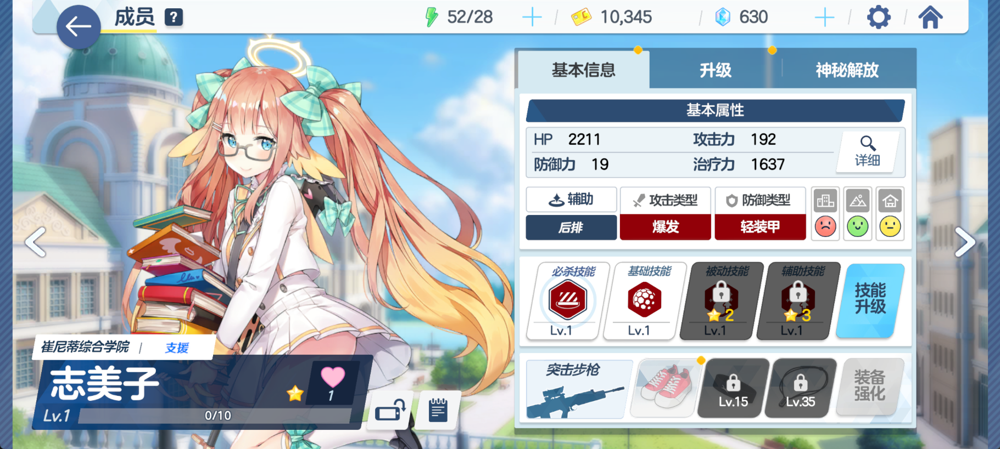

# bluearchiveChinaServerAnti-Harmony

> 这是一个蔚蓝档案反和谐仓库   

## 效果图

## 教程
如何使用：   
第一步，打开你的手机文件管理器，（推荐用MT管理器）如果找不到的[从这里下载](https://mt2.cn/download/)   
第二步：定位到 `Android/data/com.RoamingStar.BlueArchive/files/AssetBundls`   
第三步：下载仓库里的反和谐文件   
第四步：替换全部已拥有文件，完成反和谐   
第五步：打开蔚蓝档案   
文字看不懂？ [视频教程](https://www.bilibili.com/video/BV1PM4y1p79e/)

如果你在手机上**找不到**下载按钮，使用以下的链接之一   

### Download on Android

Choose one of the links below.

| Link provider              | Artifact                                                                                                                      |
|-----------------------|-------------------------------------------------------------------------------------------------------------------------------|
| `GitHub 官方链接`    | [bluearchiveChinaServerAnti-Harmony-main.zip](https://github.com/yemoyu123/bluearchiveChinaServerAnti-Harmony/archive/refs/heads/main.zip)   |
| `美国加速链接1` | [bluearchiveChinaServerAnti-Harmony-main.zip](https://git.xfj0.cn/https://github.com/yemoyu123/bluearchiveChinaServerAnti-Harmony/archive/refs/heads/main.zip)   |
| `美国加速链接2`        | [bluearchiveChinaServerAnti-Harmony-main.zip](https://download.njuu.cf/yemoyu123/bluearchiveChinaServerAnti-Harmony/archive/refs/heads/main.zip)         |
| `美国加速链接3`        | [bluearchiveChinaServerAnti-Harmony-main.zip](https://hub.gitmirror.com/https://github.com/yemoyu123/bluearchiveChinaServerAnti-Harmony/archive/refs/heads/main.zip)     |
| `美国加速链接4`           | [bluearchiveChinaServerAnti-Harmony-main.zip](https://download.yzuu.cf/yemoyu123/bluearchiveChinaServerAnti-Harmony/archive/refs/heads/main.zip)         |
| `德国加速链接`        | [bluearchiveChinaServerAnti-Harmony-main.zip](https://archive.fastgit.org/yemoyu123/bluearchiveChinaServerAnti-Harmony/archive/refs/heads/main.zip)     |
| `日本加速链接`      | [bluearchiveChinaServerAnti-Harmony-main.zip](https://download.fastgit.ixmu.net/yemoyu123/bluearchiveChinaServerAnti-Harmony/archive/refs/heads/main.zip)     |
| `韩国加速链接`      | [bluearchiveChinaServerAnti-Harmony-main.zip](https://ghproxy.com/https://github.com/yemoyu123/bluearchiveChinaServerAnti-Harmony/archive/refs/heads/main.zip) |
| `新加坡加速链接`         | [bluearchiveChinaServerAnti-Harmony-main.zip](https://kgithub.com/yemoyu123/bluearchiveChinaServerAnti-Harmony/archive/refs/heads/main.zip)     |
